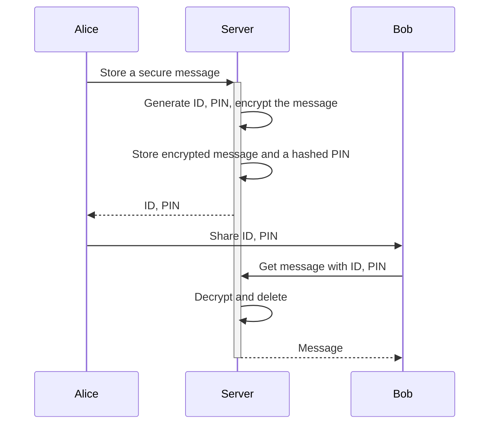
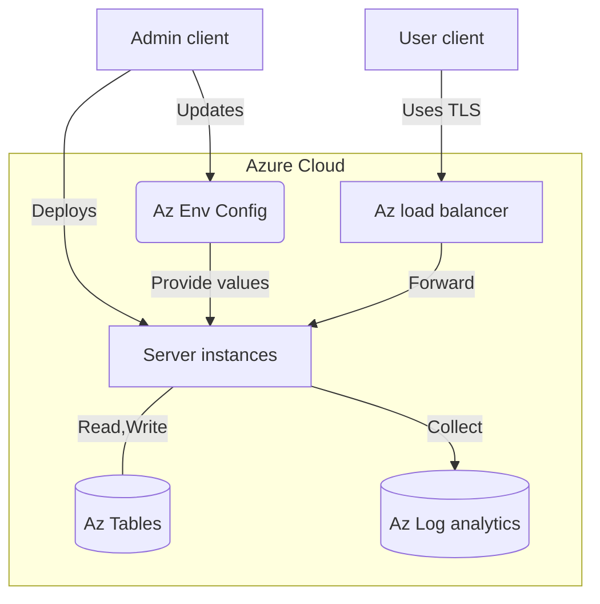
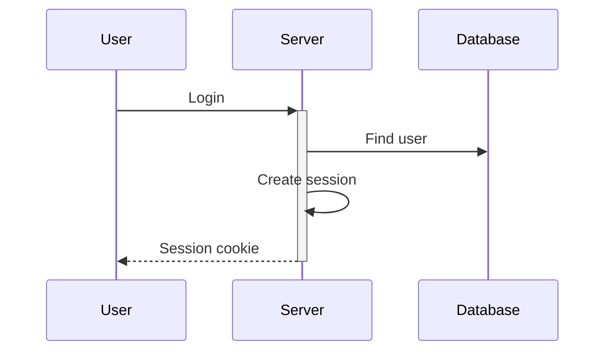

# Secret message sharing platform (IN PROGRESS)

[](https://github.com/ivarprudnikov/secret-message-share/actions/workflows/build.yml)

Preview live on https://secret-share.azurewebsites.net

Users are able to create an account and store textual content.
This could be links, notes or encoded images.
Once the content is created it can be shared with other internet
users through a unique URL. The visitors to the URL will need 
to enter a PIN to get the content.

After successful PIN entry the content is deleted from the server.
It is also deleted if the visitor fails to enter the correct PIN multiple times.



## Development

**Prerequisites**

- Install Go: https://golang.org/doc/install
- Access to Azure account: https://portal.azure.com

**Commands**

- Run tests: `go test ./...`
- Compile and execute the server binary: `SERVER_ENV=test go run .`
- Run the server in an Azure function environment locally: `./scripts/run.sh`
- Compile and deploy to Azure: `./scripts/azure.fn.deploy.sh`
- Create required Azure infrastructure: `./scripts/azure.infra.create.sh`

## Architecture

The server application is written in Go and uses the Azure Functions to serve the HTTP requests. The server is stateless and the data is going to be stored in the Azure Table Storage. The data is encrypted at rest and the keys are known only to the server and the administrators.



### Configuration

The server is configured using the environment variables. The configuration values are provided by the Azure Function App service after the application is deployed to the cloud service. The configuration values are stored in the Azure Function App service and are not exposed to the public.

The required values are:
- `DB_SALT_KEY` - used in the encryption of content but not hashing
- `COOK_AUTH_KEY` - used for cookie authentication
- `COOK_ENC_KEY` - used to encrypt the cookie contents

### Storage models

There are only two things that are stored in the database: users and messages. The user is the one who creates the message and the message is the content that is shared with the anonymous users online.

```
 User { username password=hash(pass) created_at }
   |
  /|\
Message { username pin=hash(pin) content=encrypt(text,pin) digest=hash(content) attempt created_at }
```

## Security

The application employs multiple layers of security to protect the data. Furthermore the security model aims at ensuring the CIA triad: confidentiality, integrity and availability.

The development aims to follow the guidelines provided by the National Institute of Standards and Technology (NIST) [1] to ensure the security of the application.

### Network security

To ensure the confidentiality of the data in transit the application uses HTTPS with TLS 1.2 or higher. HTTPS server certificate is provided by the Azure Function App service after the application is deployed to the cloud service. The TLS connection gets established between the client (browser) and the application environment in the cloud. In our security model we trust the cloud provider to terminate TLS and forward the requests to the application in a secure manner without exposing the data to other cloud customers or external parties.

Note: The TLS certificate is not used when testing the application locally.

The availability of the service connection is ensured by the public cloud provider. The Azure Function App service is highly scalable. At the moment the application is deployed in the datacenters in the North Europe region. The cloud provider guarantees the access to the service according to the service level agreement (SLA) which mentions 99.95% guarantee. The remaining access failures are handled on the client side and use a retry policy or inform the user about the temporary unavailability of the service.

The access to the host where the server is running is restricted and all of the ports are closed except one for the web traffic.

To detect the unauthorized access to the application the server logs are used. The logs are stored in the Azure Log Analytics workspace. It is the duty of the administrators to monitor the logs and take action in case of the unauthorized access to the application. The logs are stored for an extended amount of time to allow the investigation of the security incidents.

In case of the breach the restoration of the service will either be done by the cloud provider or the administrator who has the access. The administrator can quickly apply additional network configuration changes to block the unauthorized access to the application.

### Browser security

There are a couple of main threats we are trying to mitigate against:
- The sniffing of the data in transit.
- The cross site scripting attacks.
- The cross site request forgery attacks.
- The session hijacking attacks.

The application server serves the HTML pages to the browser for the user to be able to easily navigate the features provided. There is no client side javascript being used.

The sensitive information that user submits to the server is protected with the use of the HTTPS encryption and the trusted browser security features such as sandboxing. In addition, cross site request forgery (CSRF) tokens are used in the HTML forms to prevent the one-click session attacks.

For the user to be able to maintain a session after they authenticate, the secure cookies are used in the browser. The cookies are created and set by the server and they use hash-based message authentication code (HMAC) to protect the integrity of the session information. The key used to validate the HMAC is known only to the server.



To avoid the cross site scripting issues, the user submitted content is sanitized on the server side before it is sent to the browser.

The detection of the above mentioned threats is done on the server side. Please refer to the server security section for more information. The browser based monitoring could also be added to the application to detect the threats on the client side.

In the case of the security risk arising solely on the browser side the administrator should be able to quickly react to the threat by applying the changes to the server side code and deploying the changes to the cloud environment. Any additional threats that are present in the browser environment are a sole responsibility of the browser vendor and the user. We are not responsible for the security of the specific browser environment and care must be taken by the user to ensure the security of their own environment.

### Server security

The server is using a minimal amount of third party libraries to reduce the risk from supply chain attacks. The cryptography features rely on the core support provided by the Go standard library. The recommendations for the implementation of each secure feature are followed to ensure the security of the application.

The compiled server binary, nor the open source code does not contain any sensitive information which could be used to attck the running server or decrypt the stored data.

To mitigate against the denial of service (DOS) attacks it is planned to use the rate limiting on the server side. The rate limiting will be based on the IP address of the client and the number of requests per time period. Furthermore, the application is hosted in the highly scalable cloud environment which can handle the increased load by scaling the resources automatically.

Access to the server which is hosting the compiled server binary is restricted to the authorized users only. The server is hosted in the Azure cloud environment and the access to the server is controlled by the Microsoft Entra ID and the role based access control (RBAC) policies.

Source code is stored in the GitHub account which is protected by the two factor authentication (2FA). Any changes to the source code are reviewed by the owner of the repository before they are merged to the main branch. The continuous integration (CI) pipeline is used to build and test the code before it is deployed to the cloud environment. The deployment of code can only be done by the authorized users who have the access to the Azure cloud environment.

Any secret material used in the application is provided through the environment variables.

To monitor the application the requests and errors are logged. The logs are stored in the Azure Log Analytics workspace. As mentioned in the network security serction the logs will be kept for a long time to allow the investigation of the security incidents.

In the case of the breach the server can quickly be restored to the previous state by redeploying the server binary from the source code repository. The server is stateless and the data is stored in the Azure Table Storage. The data is encrypted at rest and the keys are known only to the server and the administrators. The security keys can be rotated without the need to redeploy the server binary.

### Storage security

One of the biggest threats to the application is the unauthorized access to the stored data and its exfiltration.

The data at rest is planned to be stored in the Azure Table Storage. Azure Storage encrypts the data at rest with AES 256-bit encryption with the Azure managed keys. In addition to that all of the sensitive data is hashed or encrypted before being stored in the Table Storage with the encryption keys known to the server and administarators only.

In the case of the breach the data is hashed and salted using an OWASP recommended Argon2ID hashing algorithm to prevent the rainbow table attacks.

Additional protection is in place where the attacker tries to guess the PIN to access the message. The message will be deleted after the number of failed attempts exceeds the threshold.

Access monitoring and auditing is provided by the Azure Storage. The administrators can monitor the access to the data and take action in case of the unauthorized access.

In a case of loss or corruption of the data it will be able to restore it from the backups by the server administrators.

### Source code

The source code is stored in the GitHub repository. The repository is protected by the two factor authentication (2FA). The access to the repository is controlled by the owner of the repository.

The continuous integration (CI) pipeline is used to build and test the code before it is deployed to the cloud environment. The deployment of code can only be done by the authorized users who have the access to the Azure cloud environment.

The GiHub repository subscribes to security notifications and the owner of the repository is notified in case of the security vulnerability in the third party libraries used in the application.

## Needs further improvement

- ~Hashing needs to use salt to prevent rainbow table attacks~
- ~Secure key material need to be passed through the environment variables~
- ~Encrypt the session cookie contents in addition to the HMAC~
- Increase the size of the keys
- Add rate limiting
- ~Add logging~
- Implement Azure Table Storage
- Add backups

## References

[1] The NIST Cybersecurity Framework (CSF) 2.0 https://doi.org/10.6028/NIST.CSWP.29
[2] OWASP cheatsheet https://cheatsheetseries.owasp.org/