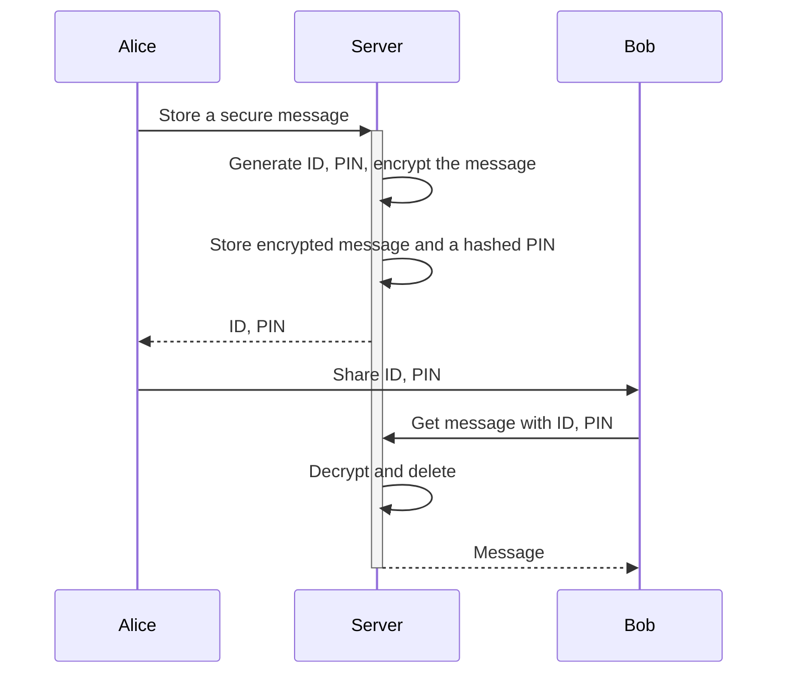
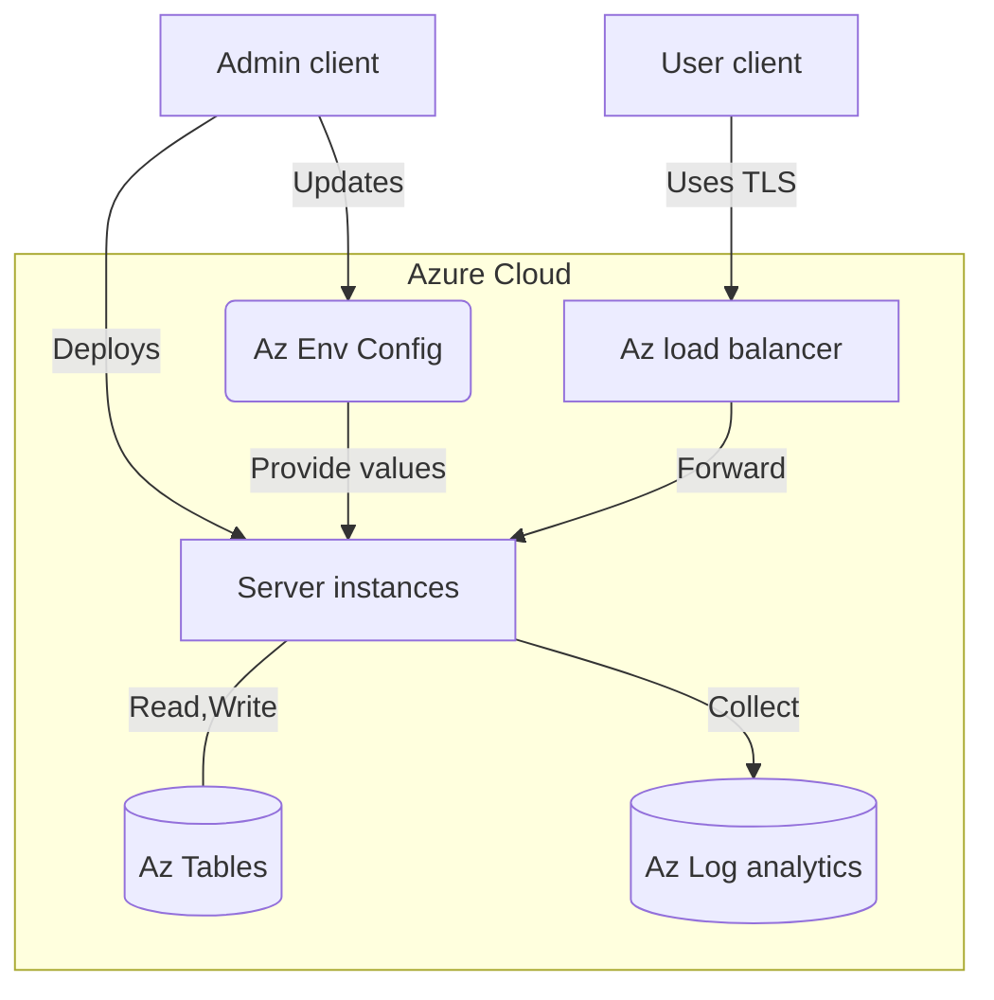

# Secret message sharing platform (IN PROGRESS)

[](https://github.com/ivarprudnikov/secret-message-share/actions/workflows/build.yml)

Preview live on https://secret-share.azurewebsites.net

Users are able to create an account and store textual content.
This could be links, notes or encoded images.
Once the content is created it can be shared with other internet
users through a unique URL. The visitors to the URL will need 
to enter a PIN to get the content.

After successful PIN entry the content is deleted from the server.
It is also deleted if the visitor fails to enter the correct PIN multiple times.



## Development

**Prerequisites**

- Install Go to compile and run the application: https://golang.org/doc/install
- Install Node to run e2e tests: https://nodejs.org/en/download/
- Access to Azure if you will create/update/deploy function app: https://portal.azure.com

**Commands**

- Testing
  - Run unit tests: `go test ./...`
  - Run functional end-to-end (e2e) tests, [see readme](cypress/README.md)
- Running locally
  - Compile and execute the server binary: `SERVER_ENV=test go run .`
  - Or, run the server in an Azure function environment locally: `./scripts/run.sh`
- Deployment
  - Compile and deploy to Azure: [azure.fn.deploy.sh](deployments/azure.fn.deploy.sh)
  - Create required Azure infrastructure: [azure.infra.create.sh](deployments/azure.infra.create.sh)

## Architecture

The server application is written in Go and uses the Azure Functions to serve the HTTP requests. The server is stateless and the data is going to be stored in the Azure Table Storage. The data is encrypted at rest and the keys are known only to the server and the administrators.



### Configuration

The server is configured using the environment variables. The configuration values are provided by the Azure Function App service after the application is deployed to the cloud service. The configuration values are stored in the Azure Function App service and are not exposed to the public.

The required values are:
- `DB_SALT_KEY` - used in the encryption of content but not hashing
- `COOK_AUTH_KEY` - used for cookie authentication
- `COOK_ENC_KEY` - used to encrypt the cookie contents

### Storage models

There are only two things that are stored in the database: users and messages. The user is the one who creates the message and the message is the content that is shared with the anonymous users online.

```
 User { username password=hash(pass) created_at }
   |
  /|\
Message { username pin=hash(pin) content=encrypt(text,pin) digest=hash(content) attempt created_at }
```

## About security

See [SECURITY.md](SECURITY.md) for more details about the steps taken to ecure the data and the application.

## Needs further improvement

- Increase the size of the keys
- Add rate limiting
- Implement Azure Table Storage
- Add backups

## References

[1] The NIST Cybersecurity Framework (CSF) 2.0 https://doi.org/10.6028/NIST.CSWP.29
[2] OWASP cheatsheet https://cheatsheetseries.owasp.org/